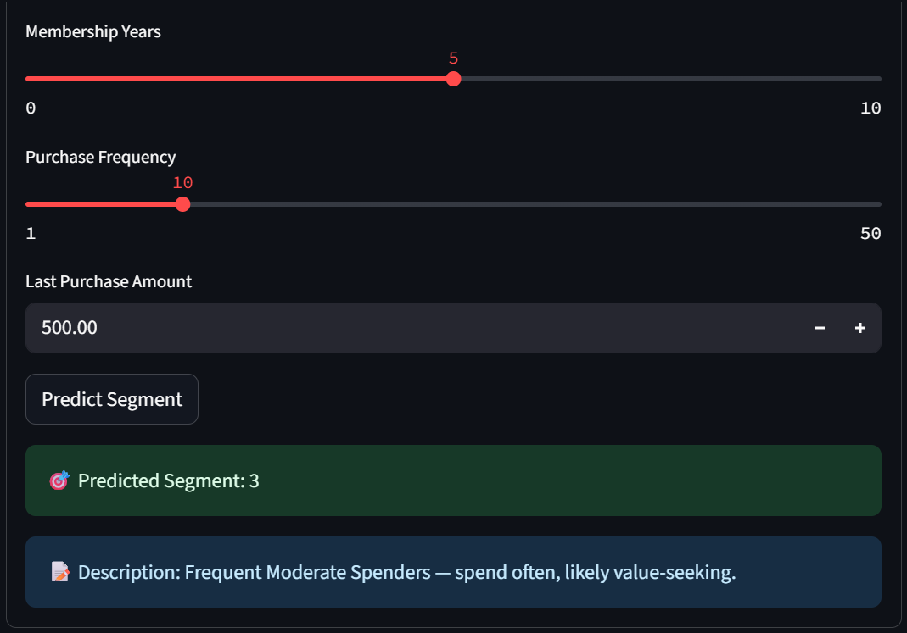
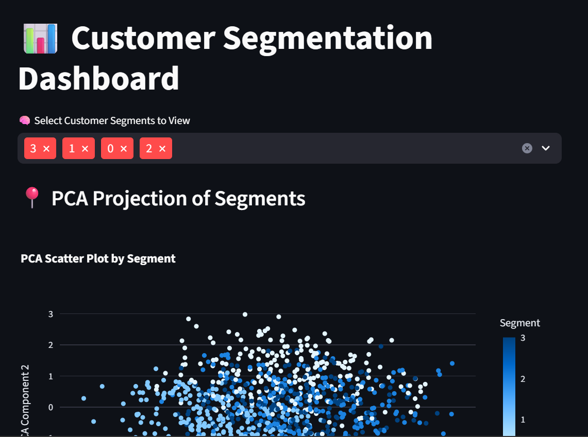
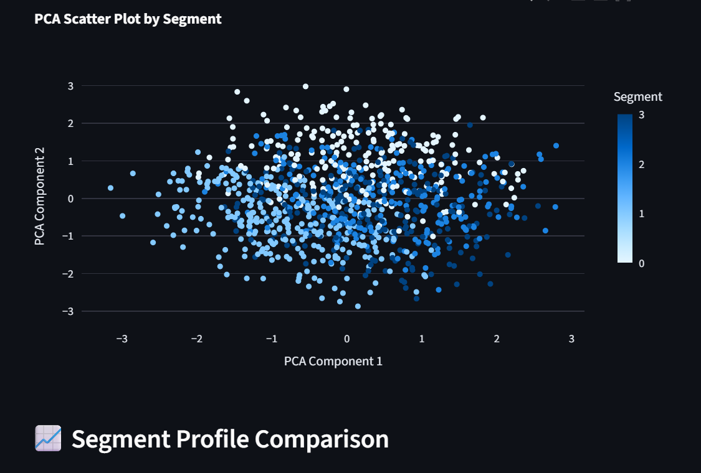

# Customer Segmentation Project

This project performs customer segmentation using KMeans clustering on customer data including age, income, spending score, and purchase behavior. 

## Features
- Data exploration and visualization
- Elbow method to find optimal clusters
- Clustering using KMeans
- Segment profile visualization with radar charts
- Interactive dashboard using Streamlit for exploration and prediction

## How to run
1. Install requirements: `pip install -r requirements.txt`
2. Run Streamlit dashboard: `streamlit run app.py`

## Streamlit Dashboard Preview

Explore the customer segmentation interactively via this dashboard:

https://github.com/AnushaJoseph-00/Customer_Segmentation_Project/blob/6330411c50703ba1045b51ad2f6abd3669e99d85/Screenshot%202025-07-25%20143354.png

## Data
Dataset includes customer records with purchase data.

